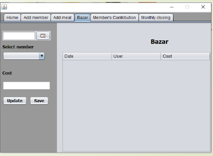

# Meal Management System

A Java-based solution to streamline meal management in bachelor messes or student hostels. This project, built using Java Swing and MySQL, provides an admin-controlled interface to manage member records, meal tracking, monthly expenses, deposits, and other essential hostel management features. Designed to save time, automate calculations, and securely store data, this system simplifies hostel meal administration.

## Table of Contents
- [Project Overview](#project-overview)
- [Features](#features)
- [Technologies Used](#technologies-used)
- [Setup](#setup)
- [Usage](#usage)
- [Screenshots](#screenshots)
- [Future Enhancements](#future-enhancements)
- [Acknowledgments](#acknowledgments)

## Project Overview

The Meal Management System is a desktop application created to solve common problems faced in student hostels or bachelor messes. It allows an admin to manage meal-related information for multiple members without requiring programming knowledge. By automating calculations and data storage, this system ensures accuracy and reduces the risk of data loss.

## Features

1. **Authentication**: Secure login and signup interfaces for manager access.
2. **Dashboard**: 
   - **Member Management**: Add and manage meal members, track their meals, record expenses, and manage deposits.
   - **Monthly Closing**: A dedicated panel to calculate and display total expenses for each member.
   - **Data Display**: Tables, labels, and text fields for easy data input and viewing.
3. **Database Integration**: All records are stored in a MySQL database using XAMPP, ensuring secure data storage and easy retrieval.
4. **Partial Update/Delete Functionality**: Basic buttons and fields for updating and deleting records, with some functionalities yet to be fully implemented.

## Technologies Used

- **Language**: Java
- **Framework**: Java Swing
- **Platform**: NetBeans IDE 8.0.2
- **Database**: MySQL (via XAMPP)

## Setup

1. **Clone the Repository**:
   ```bash
   git clone github.com/Rayhan-002/Meal-Management
## Database Configuration

1. Import `users_db.sql` to set up the database in MySQL.
2. Use XAMPP to start the MySQL server.

## Run the Project

1. Open the project in NetBeans IDE.
2. Configure database connection settings in `mysql_connector.java` as required.
3. Run the main class (`Main.java`) to start the application.

## Usage

1. **Login/Signup**: Start by creating an account or logging in as an admin.

2. **Dashboard**:
   - **Add Members**: Input member details and meal preferences.
   - **Manage Expenses**: Track each member's expenses and deposits accurately.
   - **Monthly Closing**: Utilize this feature to perform calculations and display results.

3. **Database Operations**: All actions are saved directly to the database for persistent data storage.

> **Note**: Some update and delete functionalities are incomplete, and certain bugs may affect operations.

## Screenshots





## Future Enhancements

- Implement database relationships for improved data handling.
- Transition to an online, multi-user application for better accessibility.
- Expand to a comprehensive hostel management system, including rent, utility fees, and student records.
- Integrate an online payment API for easy transactions.

## Acknowledgments

This project was developed as part of a course requirement at Rajshahi University of Engineering & Technology, under the supervision of Assistant Professor Rizoan Toufiq.
